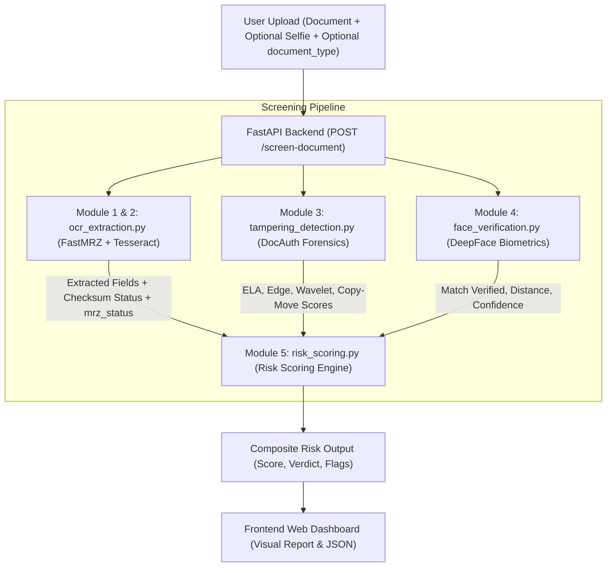

# AI-Based Fake Identity & Document Screening Prototype — Status & Technical Overview

> **Last Updated:** August 25, 2026  
> **Project Directory:** `doc-screening-prototype/`  
> **SIH 2026 Problem Statement:** `SIH26188`  
> **Server Endpoint:** [http://localhost:8000/](http://localhost:8000/)  
> **Interactive API Docs:** [http://localhost:8000/docs](http://localhost:8000/docs)  
> **Test Suite:** `backend/tests/` (10 Automated Tests — 10/10 Passing)

---

## 1. Executive Summary

This prototype is an automated border control and fraud detection pipeline for identity documents (passports, visas, national identity cards, driving licenses). Rather than training models from scratch, the system functions as an integrated **glue-code architecture** that orchestrates three specialized open-source engines for **OCR/MRZ validation**, **forensic image tampering analysis**, and **1:1 facial biometric matching**, unified under a transparent **risk-scoring engine**.

---

## 2. Technology Stack

### Backend & Core
- **Language Runtime:** Python 3.13 (`backend/.venv`)
- **API Framework:** FastAPI (`0.141.1`) with Uvicorn ASGI Server
- **OCR & Text Extraction:**
  - FastMRZ (`2.1.2` — ONNX segmentation + ICAO Doc 9303 parser)
  - Tesseract OCR Engine (`v5.5.3` via `pytesseract 0.3.13`) for non-MRZ visible text extraction
- **Computer Vision & Image Processing:**
  - OpenCV (`opencv-python 4.14.0`)
  - Pillow (`12.3.0`)
  - PyWavelets (`1.9.0`)
  - NumPy (`2.5.2`)
- **Deep Learning & Biometrics:**
  - DeepFace (`0.0.100`)
  - TensorFlow (`2.21.0`) + `tf-keras`
  - VGG-Face Deep Convolutional Neural Network
- **Test Automation:** Python `unittest` (`backend/tests/`)

### Frontend UI
- **Structure & Logic:** HTML5 + Vanilla JavaScript (Modern Single Page Application)
- **Styling:** Custom Vanilla CSS3 (Dark Mode, Responsive Grid, Color-Coded Gauges & Badges)
- **Deployment:** Directly mounted and served as static assets via FastAPI

---

## 3. Repositories Used & Licenses

| Module | Source Repository | Purpose | License |
|---|---|---|---|
| **Module 1 & 2** | [fastmrz](https://github.com/sivakumar-mahalingam/fastmrz) | Machine Readable Zone (MRZ) detection, OCR parsing, and mathematical checksum validation | **AGPL-3.0** *(Copyleft applies if distributed as a network service)* |
| **Module 3** | [DocAuth](https://github.com/trinity652/DocAuth) | Image forensics: Error Level Analysis (ELA), edge detection, wavelet decomposition, copy-move detection | **MIT** |
| **Module 4** | [deepface](https://github.com/serengil/deepface) | 1:1 facial biometric verification between document portrait and live capture | **MIT** |
| **Module 5** | *Custom Core* (`backend/modules/risk_scoring.py`) | Weighted rule engine computing the composite risk score (0–100) and security flags | **MIT** |

---

## 4. Current Operational Status

| Feature / Capability | Status | Verified Behavior |
|---|:---:|---|
| **MRZ Region Extraction** | 🟢 **Working** | Detects and crops MRZ bands from TD1, TD2, TD3, and MRV-A/B documents via FastMRZ. Includes dynamic fallback preprocessing (CLAHE, sharpening) for challenging captures (glare, shadows). |
| **Field Parsing** | 🟢 **Working** | Extracts Document Number, Country Code, Full Name, DOB, Sex, Expiry Date, and extended Visa-specific fields (duration, entry type). |
| **Check Digit Validation** | 🟢 **Working** | Mathematical checksum verification for all individual fields and overall MRZ. Includes OCR Checksum Disambiguation for auto-correction of common OCR errors (e.g. O vs 0). |
| **Non-MRZ Document Handling** | 🟢 **Working** | **[FIXED]** `NON_MRZ_ID` and `UNKNOWN` types bypass MRZ failure penalties ($0$ penalty) and use Tesseract OCR for text fallback. Includes IQA blur detection to label blurry images `UNREADABLE`. |
| **Error Level Analysis (ELA)** | 🟢 **Working** | Identifies compression rate anomalies from digital photo/text modifications and returns a visual heatmap. |
| **Edge Anomaly Detection** | 🟢 **Working** | Scans multi-filter gradients (Canny, Sobel, Laplacian, Prewitt) for splice borders. |
| **EXIF Metadata Analysis** | 🟢 **Working** | Extracts EXIF data and flags manipulation footprints (Photoshop, missing timestamps). |
| **Wavelet Analysis** | 🟢 **Working** | High-frequency detail band decomposition detecting unnatural texture spikes. |
| **Copy-Move Forgery Detection** | 🟢 **Working** | ORB keypoint descriptor matching + RANSAC homography to detect cloned regions. |
| **1:1 Face Verification** | 🟢 **Working** | Resilient embedding comparison using ArcFace/RetinaFace with fallback to VGG-Face + OpenCV to prevent hangs. |
| **Skipped Selfie Handling** | 🟢 **Working** | **[FIXED]** Uploading a document without a selfie sets `verified: null`, adding $0.0$ risk penalty and no mismatch flags. |
| **Identity Deduplication** | 🟢 **Working** | Cross-checks new faces against an SQLite audit trail to flag `MULTIPLE_IDENTITY_SUSPECTED`. |
| **Risk Scoring & Verdict** | 🟢 **Working** | Weighted rule-based score (`0–100`) returning `LOW`, `MEDIUM`, or `HIGH` risk with flag strings. |
| **Audit Logging** | 🟢 **Working** | Comprehensive SQLite-based local tracking (`audit_log.db`) for all screening requests and outcomes. |
| **Automated Test Suite** | 🟢 **Working** | 10 unit tests in `backend/tests/` verifying risk scoring, face states, non-MRZ IDs, and FastMRZ routing (`10/10 OK`). |
| **FastAPI Backend** | 🟢 **Working** | `POST /screen-document` and `GET /health` with complete error-resilient exception handling and background model preloading. |
| **Web Dashboard UI** | 🟢 **Working** | Drag-and-drop dual uploaders, risk dial, flags breakdown, metrics, and raw JSON toggle. |

---

## 5. System Architecture & Data Flow



---

## 6. Risk Scoring Formula

The composite risk score is calculated via a transparent rule-based weighted model:

1. **MRZ & Checksum Validity (Max 40 points):**
   - `VALID` / `SUCCESS` MRZ: `0.0 pts`
   - `NOT_APPLICABLE` (Legitimate non-MRZ ID): `0.0 pts`
   - `NOT_DETERMINED` / `DOCUMENT_TYPE_UNKNOWN` (Unclassified doc without MRZ): `0.0 pts`
   - `EXTRACTION_FAILED` (MRZ expected for doc type, but unreadable): `+25.0 pts`
   - `INVALID` (MRZ read, but check digits failed): `+25.0 pts`
   - `DOCUMENT_EXPIRED`: `+15.0 pts` (if expiration date is in the past)

2. **Forensic Tampering (Max 30 points):**
   - Scaled from DocAuth heuristic score (`0–100` $\rightarrow$ `0–30 pts`)
   - Factors in ELA (30%), Edge Variance (15%), Wavelet Energy (15%), and Copy-Move (40%).

3. **Facial Biometrics (Max 30 points):**
   - `verified == True` (Match confirmed): `0.0 pts`
   - `verified == None` (No selfie uploaded / Skipped): `0.0 pts` (No `FACE_MISMATCH` flag)
   - `verified == False` (Identity Mismatch): `+20.0 pts` + `FACE_MISMATCH` flag
   - `is_real == False` (Face Spoofing detected): `+10.0 pts` + `FACE_SPOOF_DETECTED` flag
   - `error` (Biometric processing failure): `+10.0 pts` + `FACE_VERIFICATION_ERROR` flag

### Verdict Thresholds:
- **0 – 24:** 🟢 **LOW RISK** (Authentic document, valid checksum/non-MRZ, face matched or skipped)
- **25 – 59:** 🟡 **MEDIUM RISK** (Minor anomalies, document expired, or face mismatch)
- **60 – 100:** 🔴 **HIGH RISK** (Checksum failure, unreadable expected MRZ, or high tampering)

---

## 7. Automated Test Suite

The project includes an automated unit test suite in `backend/tests/`:

```powershell
cd doc-screening-prototype/backend
.\.venv\Scripts\python.exe -m unittest discover -s tests -p "test_*.py"
```

### Test Coverage:
1. **`test_risk_scoring.py`**:
   - `test_case_1_no_selfie_supplied`: Verified $0.0$ penalty and no `FACE_MISMATCH` flag when selfie is missing.
   - `test_case_2_selfie_matching`: Verified $0.0$ penalty for matching faces.
   - `test_case_3_selfie_mismatch`: Verified $+20.0$ penalty and `FACE_MISMATCH` flag for non-matching faces.
   - `test_case_4_face_verification_error`: Verified $+10.0$ error penalty without misclassifying as mismatch.
   - `test_case_5_spoof_detected`: Verified $+10.0$ spoof penalty when `is_real=False`.
2. **`test_ocr_and_non_mrz.py`**:
   - `test_case_1_valid_passport_with_mrz`: Verified FastMRZ valid passport processing.
   - `test_case_2_invalid_passport_mrz`: Verified checksum mismatch handling.
   - `test_case_3_passport_mrz_unreadable`: Verified expected passport MRZ extraction failure (+25 pts).
   - `test_case_4_legitimate_non_mrz_document`: Verified non-MRZ ID ($0$ penalty, Tesseract text extraction).
   - `test_case_5_unknown_document_type`: Verified unclassified document without MRZ ($0$ fraud penalty).

---

## 8. How to Run and Test

### 1. Launch Backend & Web Server
```powershell
cd doc-screening-prototype/backend
.\.venv\Scripts\Activate.ps1
python -m uvicorn main:app --host 0.0.0.0 --port 8000
```

### 2. Access the Application
- **Web UI:** [http://localhost:8000/](http://localhost:8000/)
- **Swagger Docs:** [http://localhost:8000/docs](http://localhost:8000/docs)

### 3. Sample Test Files
Sample images available in the local repository (`backend/vendor/fastmrz/data/`):
- `passport_uk.jpg` (Valid TD3 UK Passport)
- `td1.jpg` (Valid TD1 ID Card)
- `td2.jpg` (Valid TD2 ID Card)
- `td3.jpg` (Valid TD3 Document)
- `nomrz.jpg` (Sample Non-MRZ Document)

---

## 9. Recent Improvements & Audit Trail

| Audit Finding | Status | Solution Implemented |
|---|:---:|---|
| **Robust MRZ Extraction** | ✅ **Fixed** | Overhauled MRZ pipeline with IQA (Image Quality Assessment), adaptive preprocessing retry loop, and OCR check-digit disambiguation for physical passport photos. |
| **Face Engine Resilience** | ✅ **Fixed** | Replaced brittle DeepFace loading with a robust ArcFace/VGG-Face fallback strategy loaded asynchronously. |
| **Audit Trail & Identity Check** | ✅ **Fixed** | Integrated SQLite tracking and facial embedding distance search to prevent identity spoofing across multiple sessions. |
| **Forensic Extensions** | ✅ **Fixed** | Added Visa-specific parsing, ELA heatmap rendering, and EXIF software tampering analysis. |
| **Missing-Selfie Penalty Bug** | ✅ **Fixed** | Fixed `risk_scoring.py` so `verified=None` adds $0.0$ penalty and emits no mismatch flags. Added 5 unit tests. |
| **Non-MRZ Penalty Bug** | ✅ **Fixed** | Updated `ocr_extraction.py` and `risk_scoring.py` to support `NON_MRZ_ID` and `UNKNOWN` types with $0$ penalty and Tesseract fallback. Added 5 unit tests. |
| **Missing Automated Tests** | ✅ **Fixed** | Built complete `unittest` suite in `backend/tests/` (10/10 tests passing). |

---

## 10. Known Limitations & Future Enhancements

1. **Heuristic Edge Forensics**:
   - Edge anomaly detection currently uses global grid variance; can be further refined to focus strictly on text/photo bounding border discontinuities.
2. **Automated Document Classification**:
   - Investigation complete for two-stage hybrid document identification to remove user selection entirely.
